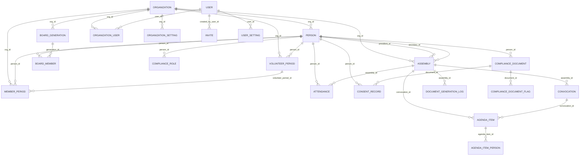

# Database Schema

Gestionale ETS uses **SQLite** via Cloudflare D1 as its database layer, with **Drizzle ORM** handling migrations and type safety.

## Quick Links

- [Core Data Model](#core-data-model)
- [Entity Relationship Diagram](#entity-relationship-diagram)
- [Table Definitions](#table-definitions)
- [Lookup Tables (Enums)](#lookup-tables-enums)
- [Constraints & Indexes](#constraints--indexes)
- [Data Lifecycle](#data-lifecycle)

---

## Core Data Model

The database is organized around four main domains:

### 1. **Organization & People**
- **organization** — Multi-tenant org definition
- **person** — Individual people (members, volunteers, staff)
- **volunteerPeriod** — Volunteer tenure (enrollment → exit)
- **memberPeriod** — Member tenure (admission → resignation)

### 2. **Governance & Board**
- **boardGeneration** — A board term (e.g., "2019-2020")
- **boardMember** — Individual board members with roles

### 3. **Assemblies & Meetings**
- **assembly** — General assembly, board council, or constituent assembly
- **convocation** — Formal notice/invitation to attend assembly
- **attendance** — Attendance record (who attended, how)
- **agendaItem** — Agenda points (topics, resolutions)
- **agendaItemPerson** — Junction for people involved in agenda items (candidates, excluded, etc.)

### 4. **Compliance & Consent**
- **complianceRole** — Roles for compliance tracking (Data Protection Officer, etc.)
- **complianceDocument** — Signed documents (policies, waivers)
- **consentRecord** — Explicit consent/withdrawal for uses of personal data
- **alertSuppression** — Suppress system alerts for specific people/conditions

### 5. **Users & Access Control**
- **user** — User account (email, password, Google OAuth)
- **organization_user** — Link user to org with role/permissions
- **invite** — Invitation tokens for new team members
- **userSetting** — Per-user preferences (theme, etc.)

### 6. **Reference Data & Configuration**
- **organizationSetting** — Org-level settings (email, compliance rules, template IDs)
- **organizationAddress** — Org's address history
- **convocationModalityOption** — Modality templates for convocations/minutes

### 7. **Audit & Logging**
- **documentGenerationLog** — Audit trail of generated documents
- **auditEvent** — System event log
- **setupAttempt** — Rate limiting for setup endpoint

---

## Entity Relationship Diagram



---

## Table Definitions

### Core Tables

#### **organization**
Represents a single tenant (nonprofit/voluntary organization).

| Column | Type | Constraints | Description |
|--------|------|-------------|-------------|
| `id` | TEXT | PK | UUID |
| `name` | TEXT | NOT NULL | Organization name |
| `short_name` | TEXT | NOT NULL | Abbreviated name |
| `slug` | TEXT | UNIQUE NOT NULL | URL-friendly identifier |
| `auth_domain` | TEXT | UNIQUE | Optional custom auth domain |
| `domain_signup_mode` | TEXT | DEFAULT 'invite_only' | 'invite_only' or 'open' |
| `tagline` | TEXT | | Marketing text |
| `support_email` | TEXT | | Support contact |
| `logo_data_url` | TEXT | | Base64-encoded logo |
| `is_setup_complete` | INTEGER | DEFAULT 0 | Boolean flag (0/1) |
| `created_at` | TEXT | NOT NULL | ISO8601 timestamp |

---

#### **person**
Represents an individual (volunteer, member, staff, etc.).

| Column | Type | Constraints | Description |
|--------|------|-------------|-------------|
| `id` | TEXT | PK | UUID |
| `org_id` | TEXT | NOT NULL, FK | Organization (indexed) |
| `first_name` | TEXT | NOT NULL | |
| `last_name` | TEXT | NOT NULL | |
| `tax_id` | TEXT | | Italian tax ID (codice fiscale) |
| `email` | TEXT | | Email address |
| `phone` | TEXT | | Phone number |
| `birth_date` | TEXT | | ISO8601 date |
| `birth_place` | TEXT | | |
| `birth_country` | TEXT | | |
| `gender` | TEXT | | M/F/Other |
| `profession` | TEXT | | |
| `is_student` | INTEGER | DEFAULT 0 | Boolean (0/1) |
| `is_employee` | INTEGER | DEFAULT 0 | Boolean (0/1) |
| `member_number` | TEXT | | Legacy identifier |
| `notes` | TEXT | | Free-form notes |
| `cf_validation` | TEXT | | Validation status or error JSON |
| `user_id` | TEXT | FK | Link to `user` account (optional) |
| **Volunteer Registry (Legacy)** | | | *Phase 5: deprecated* |
| `in_libro_volontari_cartaceo` | INTEGER | DEFAULT 0 | *Legacy Italian name* |
| `libro_volontari_start_date` | TEXT | | *Legacy Italian name* |
| `libro_volontari_end_date` | TEXT | | *Legacy Italian name* |
| `appears_in_runts_verbale` | INTEGER | DEFAULT 0 | *Legacy Italian name* |
| **Volunteer Registry (Current)** | | | *Phase 5: new English names* |
| `is_in_volunteer_registry_physical` | INTEGER | DEFAULT 0 | Boolean (0/1) |
| `volunteer_registry_start_date` | TEXT | | ISO8601 date |
| `volunteer_registry_end_date` | TEXT | | ISO8601 date |
| `appears_in_runts_proceedings` | INTEGER | DEFAULT 0 | Boolean (0/1) |
| **Computed Fields** | | | |
| `can_be_removed` | INTEGER | DEFAULT 1 | Boolean; false if referenced in assembly |
| `needs_regularization` | INTEGER | DEFAULT 0 | Boolean; auto-computed |
| `is_presumed_non_existent` | INTEGER | DEFAULT 0 | Marked as phantom/unverified |
| `created_at` | TEXT | NOT NULL | ISO8601 timestamp |
| `updated_at` | TEXT | NOT NULL | ISO8601 timestamp |

**Constraints:**
- `UNIQUE(org_id, tax_id)` — Tax ID unique per organization
- `INDEX idx_person_org_id` — Query by org

---

#### **volunteerPeriod**
Tracks when a person was enrolled as a volunteer.

| Column | Type | Constraints | Description |
|--------|------|-------------|-------------|
| `id` | TEXT | PK | UUID |
| `org_id` | TEXT | NOT NULL, FK | Organization |
| `person_id` | TEXT | NOT NULL, FK → person | |
| `status` | TEXT | NOT NULL | 'active', 'inactive', 'suspended', 'resigned' (legacy) |
| `status_id` | TEXT | FK → volunteerStatus | Phase 3: reference to lookup table |
| `enrollment_date` | TEXT | NOT NULL | ISO8601 date |
| `exit_date` | TEXT | | ISO8601 date (null if active) |
| `exit_reason` | TEXT | | |
| `notes` | TEXT | | |
| `created_at` | TEXT | NOT NULL | ISO8601 timestamp |

**Constraints:**
- `INDEX idx_volunteer_period_org_id`

---

#### **memberPeriod**
Tracks when a person was admitted as a member (after volunteer period).

| Column | Type | Constraints | Description |
|--------|------|-------------|-------------|
| `id` | TEXT | PK | UUID |
| `org_id` | TEXT | NOT NULL, FK | Organization |
| `person_id` | TEXT | NOT NULL, FK → person | |
| `volunteer_period_id` | TEXT | NOT NULL, FK → volunteerPeriod | |
| `admission_date` | TEXT | NOT NULL | ISO8601 date |
| `resignation_date` | TEXT | | ISO8601 date (null if active) |
| `exit_reason` | TEXT | | |
| `article_reference` | TEXT | | Statute article reference |
| `admission_assembly_id` | TEXT | FK → assembly | Assembly where admitted |
| `exit_assembly_id` | TEXT | FK → assembly | Assembly where resigned |
| `notes` | TEXT | | |
| `created_at` | TEXT | NOT NULL | ISO8601 timestamp |

**Constraints:**
- `INDEX idx_member_period_org_id`

---

#### **boardGeneration**
Represents a board term (mandate period).

| Column | Type | Constraints | Description |
|--------|------|-------------|-------------|
| `id` | TEXT | PK | UUID |
| `org_id` | TEXT | NOT NULL, FK | Organization |
| `name` | TEXT | NOT NULL | E.g., "2019-2020 (1°)" |
| `start_date` | TEXT | NOT NULL | ISO8601 date |
| `end_date` | TEXT | | ISO8601 date (null if ongoing) |
| `created_at` | TEXT | NOT NULL | ISO8601 timestamp |

**Constraints:**
- `INDEX idx_board_generation_org_id`

---

#### **boardMember**
Links person to board generation with role.

| Column | Type | Constraints | Description |
|--------|------|-------------|-------------|
| `id` | TEXT | PK | UUID |
| `org_id` | TEXT | NOT NULL, FK | Organization |
| `generation_id` | TEXT | NOT NULL, FK → boardGeneration | |
| `person_id` | TEXT | NOT NULL, FK → person | |
| `role` | TEXT | NOT NULL | 'president', 'vice_president', 'treasurer', 'secretary', 'councilor' |
| `notes` | TEXT | | |
| `created_at` | TEXT | NOT NULL | ISO8601 timestamp |

**Constraints:**
- `INDEX idx_board_member_org_id`

---

#### **assembly**
Represents a general/extraordinary assembly or board council.

| Column | Type | Constraints | Description |
|--------|------|-------------|-------------|
| `id` | TEXT | PK | UUID |
| `org_id` | TEXT | NOT NULL, FK | Organization |
| `type` | TEXT | NOT NULL | 'ordinary', 'extraordinary', 'board_council', 'constitution' (legacy) |
| `type_id` | TEXT | FK → assemblyType | Phase 2: reference to lookup |
| `subtype` | TEXT | | Extraordinary: 'generic', 'statute_modification', 'dissolution', 'merger_split' |
| `subtype_id` | TEXT | FK → assemblySubtype | Phase 2: reference to lookup |
| `deposited_on_runts` | INTEGER | DEFAULT 0 | Boolean (0/1) |
| `runts_deposit_date` | TEXT | | ISO8601 date |
| `total_number` | INTEGER | NOT NULL | Sequential number across org |
| `reference_number` | INTEGER | NOT NULL | Reset per year or per mandate |
| `reference_year` | INTEGER | | For annual numbering |
| `first_call_date` | TEXT | | ISO8601 date/time |
| `first_call_time` | TEXT | | HH:MM format |
| `second_call_date` | TEXT | | ISO8601 date (if quorum not met) |
| `second_call_time` | TEXT | | HH:MM format |
| `location` | TEXT | NOT NULL | Address/description |
| `location_id` | TEXT | FK → assemblyLocation | Phase 2: reference to lookup |
| `mode` | TEXT | NOT NULL | 'in_person', 'remote', 'hybrid' (legacy) |
| `mode_id` | TEXT | FK → modeOption | Phase 2: reference to lookup |
| `board_generation_id` | TEXT | FK → boardGeneration | Related board mandate (if applicable) |
| `assembly_status` | TEXT | | 'held', 'deserted', 'not_planned' (legacy) |
| `status_id` | TEXT | FK → assemblyStatus | Phase 2: reference to lookup |
| `president_id` | TEXT | FK → person | Chair of assembly |
| `secretary_id` | TEXT | FK → person | Secretary of assembly |
| `notes` | TEXT | | |
| `meet_link` | TEXT | | Google Meet URL |
| `google_docs_link` | TEXT | | Minutes Google Docs URL |
| `pdf_link` | TEXT | | Minutes PDF URL |
| `modality_formula_prima` | TEXT | | Boilerplate for first call |
| `first_call_modality_id` | TEXT | FK → convocationModalityOption | |
| `modality_formula_apertura` | TEXT | | Boilerplate for opening |
| `opening_modality_id` | TEXT | FK → convocationModalityOption | |
| `end_time` | TEXT | | Closing time HH:MM |
| `created_at` | TEXT | NOT NULL | ISO8601 timestamp |
| `updated_at` | TEXT | NOT NULL | ISO8601 timestamp |

**Constraints:**
- `INDEX idx_assembly_org_id`

---

#### **convocation**
Formal notice/invitation to an assembly.

| Column | Type | Constraints | Description |
|--------|------|-------------|-------------|
| `id` | TEXT | PK | UUID |
| `org_id` | TEXT | NOT NULL, FK | Organization |
| `assembly_id` | TEXT | NOT NULL, FK → assembly | Primary assembly |
| `second_assembly_id` | TEXT | FK → assembly | Secondary assembly (if two-call system) |
| `date` | TEXT | NOT NULL | ISO8601 date (notice date) |
| `send_deadline` | TEXT | | Deadline to send notice |
| `content` | TEXT | | Body text of convocation |
| `document_link` | TEXT | | Drive/document URL |
| `proxy_form_link` | TEXT | | Proxy authorization form URL |
| `notes` | TEXT | | |
| `created_at` | TEXT | NOT NULL | ISO8601 timestamp |
| `updated_at` | TEXT | NOT NULL | ISO8601 timestamp |

**Constraints:**
- `INDEX idx_convocation_org_id`

---

#### **attendance**
Records who attended (or participated remotely) in an assembly.

| Column | Type | Constraints | Description |
|--------|------|-------------|-------------|
| `id` | TEXT | PK | UUID |
| `org_id` | TEXT | NOT NULL, FK | Organization |
| `assembly_id` | TEXT | NOT NULL, FK → assembly | |
| `person_id` | TEXT | NOT NULL, FK → person | |
| `mode` | TEXT | NOT NULL | 'present', 'remote', 'proxy' (legacy) |
| `mode_id` | TEXT | FK → attendanceMode | Phase 3: reference to lookup |
| `delegator_id` | TEXT | FK → person | Who delegated to this person (if proxy mode) |
| `created_at` | TEXT | NOT NULL | ISO8601 timestamp |

**Constraints:**
- `INDEX idx_attendance_org_id`

---

#### **agendaItem**
Points on an assembly agenda.

| Column | Type | Constraints | Description |
|--------|------|-------------|-------------|
| `id` | TEXT | PK | UUID |
| `org_id` | TEXT | NOT NULL, FK | Organization |
| `convocation_id` | TEXT | FK → convocation | Associated notice |
| `number` | INTEGER | NOT NULL | Agenda point number |
| `title` | TEXT | NOT NULL | Point title |
| `description` | TEXT | | Full description |
| `resolution` | TEXT | | Resolution/decision text |
| `workflow_type` | TEXT | | 'member_admission', 'member_resignation', 'member_exclusion', 'budget_approval', 'board_election' (extensible) |
| `workflow_data` | TEXT | | JSON: { budgetYear?, includeResignationAck?, voting? } |
| `created_at` | TEXT | NOT NULL | ISO8601 timestamp |

**Constraints:**
- `INDEX idx_agenda_item_org_id`

---

#### **agendaItemPerson**
Junction table: people involved in an agenda item (candidates, excluded, etc.).

| Column | Type | Constraints | Description |
|--------|------|-------------|-------------|
| `id` | TEXT | PK | UUID |
| `org_id` | TEXT | NOT NULL, FK | Organization |
| `agenda_item_id` | TEXT | NOT NULL, FK → agendaItem | |
| `person_id` | TEXT | NOT NULL, FK → person | |
| `role` | TEXT | | E.g., 'candidate', 'excluded', 'admitted' |
| `created_at` | TEXT | NOT NULL | ISO8601 timestamp |

**Constraints:**
- `INDEX idx_agenda_item_person_org_id`

---

#### **user**
Application user account.

| Column | Type | Constraints | Description |
|--------|------|-------------|-------------|
| `id` | TEXT | PK | UUID |
| `email` | TEXT | UNIQUE NOT NULL | Login email |
| `password` | TEXT | | Hashed password (null for Google-only users) |
| `google_id` | TEXT | | Google OAuth ID |
| `google_refresh_token` | TEXT | | For token refresh |
| `google_access_token` | TEXT | | Current access token |
| `google_token_expiry` | TEXT | | ISO8601 timestamp |
| `created_at` | TEXT | NOT NULL | ISO8601 timestamp |
| `updated_at` | TEXT | | ISO8601 timestamp |

---

#### **organization_user**
Links user to organization with role/permissions.

| Column | Type | Constraints | Description |
|--------|------|-------------|-------------|
| `id` | TEXT | PK | UUID |
| `user_id` | TEXT | NOT NULL, FK → user | |
| `org_id` | TEXT | NOT NULL, FK → organization | |
| `role` | TEXT | NOT NULL | E.g., 'admin', 'editor', 'viewer' |
| `permissions` | TEXT | DEFAULT '[]' | JSON array of permission strings |
| `is_owner` | INTEGER | DEFAULT 0 | Boolean (0/1); original org creator |
| `joined_at` | TEXT | NOT NULL | ISO8601 timestamp |
| `invited_by_user_id` | TEXT | | Inviter user ID |

**Constraints:**
- `UNIQUE(user_id, org_id)`

---

#### **invite**
Invitation tokens for inviting users to organization.

| Column | Type | Constraints | Description |
|--------|------|-------------|-------------|
| `id` | TEXT | PK | UUID |
| `org_id` | TEXT | NOT NULL, FK → organization | |
| `email` | TEXT | | Invited email (optional; token can be shared) |
| `token` | TEXT | UNIQUE NOT NULL | Secure random token |
| `role` | TEXT | NOT NULL | Default role on acceptance |
| `permissions_override` | TEXT | | JSON array; overrides role defaults |
| `created_by_user_id` | TEXT | NOT NULL, FK → user | Who created the invite |
| `expires_at` | TEXT | NOT NULL | ISO8601 timestamp (e.g., +7 days) |
| `used_at` | TEXT | | Timestamp when claimed |
| `used_by_user_id` | TEXT | FK → user | Who redeemed the invite |
| `created_at` | TEXT | NOT NULL | ISO8601 timestamp |

---

#### **user_setting**
Per-user preferences.

| Column | Type | Constraints | Description |
|--------|------|-------------|-------------|
| `id` | TEXT | PK | UUID |
| `user_id` | TEXT | NOT NULL, FK → user | |
| `theme` | TEXT | DEFAULT 'dark-slate' | 'dark-slate', 'light', etc. |
| `created_at` | TEXT | NOT NULL | ISO8601 timestamp |
| `updated_at` | TEXT | NOT NULL | ISO8601 timestamp |

---

#### **organization_setting**
Organization-level configuration.

| Column | Type | Constraints | Description |
|--------|------|-------------|-------------|
| `id` | TEXT | PK | UUID |
| `org_id` | TEXT | | FK → organization (nullable per migration) |
| `compliance_rules` | TEXT | | JSON blob; compliance rule definitions |
| `city` | TEXT | | City for document generation |
| `statute_article_convocation` | TEXT | | Statute article number |
| `statute_article_proxies` | TEXT | | Statute article number |
| `statute_article_members` | TEXT | | Statute article number |
| `statute_article_board_vote` | TEXT | | Statute article number |
| `statute_article_board_election` | TEXT | | Statute article number |
| `max_proxies` | INTEGER | | Max proxies per member |
| `output_folder_id` | TEXT | | Google Drive folder ID for outputs |
| `template_convocation_id` | TEXT | | Google Docs template ID |
| `template_minutes_1a_id` | TEXT | | Google Docs template ID |
| `template_minutes_2a_id` | TEXT | | Google Docs template ID |
| `template_convocation_extraordinary_statute_id` | TEXT | | Google Docs template ID |
| `template_convocation_extraordinary_dissolution_id` | TEXT | | Google Docs template ID |
| `template_convocation_board_id` | TEXT | | Google Docs template ID |
| `template_minutes_board_id` | TEXT | | Google Docs template ID |
| `varie_default_text` | TEXT | | *Legacy Italian name* |
| `miscellaneous_default_text` | TEXT | | Default text for agenda item "Varie" |
| `created_at` | TEXT | | ISO8601 timestamp |
| `updated_at` | TEXT | | ISO8601 timestamp |

---

#### **organization_address**
Address history for organization.

| Column | Type | Constraints | Description |
|--------|------|-------------|-------------|
| `id` | TEXT | PK | UUID |
| `org_id` | TEXT | | FK → organization (nullable per migration) |
| `address` | TEXT | NOT NULL | Full address |
| `effective_from` | TEXT | NOT NULL | ISO8601 date when this address became current |
| `notes` | TEXT | | |
| `created_at` | TEXT | NOT NULL | ISO8601 timestamp |

---

### Compliance & Consent Tables

#### **compliance_role**
Tracks compliance positions (Data Protection Officer, etc.).

| Column | Type | Constraints | Description |
|--------|------|-------------|-------------|
| `id` | TEXT | PK | UUID |
| `org_id` | TEXT | NOT NULL, FK | Organization |
| `person_id` | TEXT | NOT NULL, FK → person | |
| `role_type` | TEXT | NOT NULL | 'dpo', 'legal_rep', 'admin' (legacy) |
| `role_type_id` | TEXT | FK → complianceRoleType | Phase 4: reference to lookup |
| `start_date` | TEXT | | ISO8601 date |
| `end_date` | TEXT | | ISO8601 date (null if current) |
| `notes` | TEXT | | |
| `created_at` | TEXT | NOT NULL | ISO8601 timestamp |
| `updated_at` | TEXT | NOT NULL | ISO8601 timestamp |

---

#### **compliance_document**
Signed consent/policy documents.

| Column | Type | Constraints | Description |
|--------|------|-------------|-------------|
| `id` | TEXT | PK | UUID |
| `org_id` | TEXT | NOT NULL, FK | Organization |
| `person_id` | TEXT | NOT NULL, FK → person | |
| `document_type` | TEXT | NOT NULL | 'privacy_policy', 'volunteer_agreement', etc. (legacy) |
| `document_type_id` | TEXT | FK → documentType | Phase 4: reference to lookup |
| `version` | TEXT | | Version identifier |
| `drive_url` | TEXT | | Link to signed copy |
| `signed_at` | TEXT | | ISO8601 timestamp |
| `effective_from` | TEXT | | When document became effective |
| `effective_to` | TEXT | | When document expires/ended |
| `is_current` | INTEGER | DEFAULT 1 | Is this the current version for this person/type |
| `is_signed` | INTEGER | DEFAULT 0 | Boolean (0/1) |
| `is_dated` | INTEGER | DEFAULT 0 | Boolean (0/1) |
| `is_complete` | INTEGER | DEFAULT 1 | Boolean (0/1) |
| `is_digital` | INTEGER | DEFAULT 1 | Boolean (0/1); false if physical only |
| `notes` | TEXT | | |
| `created_at` | TEXT | NOT NULL | ISO8601 timestamp |
| `updated_at` | TEXT | NOT NULL | ISO8601 timestamp |

---

#### **compliance_document_flag**
Issues/warnings attached to documents (missing signature, expired, etc.).

| Column | Type | Constraints | Description |
|--------|------|-------------|-------------|
| `id` | TEXT | PK | UUID |
| `org_id` | TEXT | NOT NULL, FK | Organization |
| `document_id` | TEXT | NOT NULL, FK → complianceDocument | |
| `code` | TEXT | NOT NULL | 'missing_signature', 'expired', 'no_drive_url' |
| `label` | TEXT | NOT NULL | Human-readable label |
| `severity` | TEXT | DEFAULT 'warning' | 'warning', 'error', 'info' |
| `is_problematic` | INTEGER | DEFAULT 1 | Boolean; flag causes alert |
| `note` | TEXT | | Additional context |
| `resolved_at` | TEXT | | When issue was resolved |
| `created_at` | TEXT | NOT NULL | ISO8601 timestamp |
| `updated_at` | TEXT | NOT NULL | ISO8601 timestamp |

---

#### **consent_record**
Explicit consent or withdrawal for data uses.

| Column | Type | Constraints | Description |
|--------|------|-------------|-------------|
| `id` | TEXT | PK | UUID |
| `org_id` | TEXT | NOT NULL, FK | Organization |
| `person_id` | TEXT | NOT NULL, FK → person | |
| `document_id` | TEXT | FK → complianceDocument | Associated document (optional) |
| `consent_type` | TEXT | NOT NULL | 'third_party', 'image_use', etc. (extensible) |
| `status` | TEXT | DEFAULT 'pending' | 'granted', 'withdrawn', 'pending' (legacy) |
| `status_id` | TEXT | FK → consentStatus | Phase 4: reference to lookup |
| `granted_at` | TEXT | | ISO8601 timestamp |
| `withdrawn_at` | TEXT | | ISO8601 timestamp |
| `policy_version` | TEXT | | Privacy policy version effective at consent time |
| `collection_method` | TEXT | | 'written_form', 'digital_checkbox', 'verbal', 'email' (legacy) |
| `collection_method_id` | TEXT | FK → collectionMethod | Phase 4: reference to lookup |
| `notes` | TEXT | | |
| `created_at` | TEXT | NOT NULL | ISO8601 timestamp |
| `updated_at` | TEXT | NOT NULL | ISO8601 timestamp |

---

### Audit & Logging

#### **document_generation_log**
Audit trail of generated documents (convocations, minutes, etc.).

| Column | Type | Constraints | Description |
|--------|------|-------------|-------------|
| `id` | TEXT | PK | UUID |
| `org_id` | TEXT | NOT NULL, FK | Organization |
| `assembly_id` | TEXT | FK → assembly | Associated assembly |
| `workflow_type` | TEXT | NOT NULL | 'convocation_1a', 'minutes_2a', etc. |
| `assembly_number` | INTEGER | NOT NULL | Reference number |
| `first_call_date` | TEXT | NOT NULL | DD/MM/YYYY format |
| `triggered_by` | TEXT | NOT NULL | User email (immutable) |
| `triggered_by_id` | TEXT | FK → user | For referential integrity |
| `status` | TEXT | NOT NULL | 'success', 'error' |
| `error_message` | TEXT | | Error details (if status='error') |
| `convocazione_drive_url` | TEXT | | Generated Drive URL |
| `verbale1a_drive_url` | TEXT | | Generated Drive URL |
| `verbale2a_drive_url` | TEXT | | Generated Drive URL |
| `convocazione_pdf_url` | TEXT | | Generated PDF URL |
| `verbale1a_pdf_url` | TEXT | | Generated PDF URL |
| `verbale2a_pdf_url` | TEXT | | Generated PDF URL |
| `notes` | TEXT | | |
| `created_at` | TEXT | NOT NULL | ISO8601 timestamp |

---

#### **audit_event**
General system event log.

| Column | Type | Constraints | Description |
|--------|------|-------------|-------------|
| `id` | TEXT | PK | UUID |
| `event_type` | TEXT | NOT NULL | 'user_login', 'person_created', 'assembly_held', etc. |
| `actor_id` | TEXT | | User ID (if applicable) |
| `org_id` | TEXT | | Organization ID (if applicable) |
| `payload` | TEXT | | JSON payload with event details |
| `ip` | TEXT | | IP address of request |
| `created_at` | TEXT | NOT NULL | ISO8601 timestamp |

---

#### **setup_attempt**
Rate limiting for setup endpoint.

| Column | Type | Constraints | Description |
|--------|------|-------------|-------------|
| `id` | TEXT | PK | UUID |
| `ip` | TEXT | NOT NULL | Client IP address |
| `attempted_at` | TEXT | NOT NULL | ISO8601 timestamp |

---

## Lookup Tables (Enums)

The following tables hold enumerated values (Phase 1-5 Schema Normalization). Each has a consistent structure:

```
id (PK)
code (UNIQUE) — System identifier
name — Display name
description (optional) — Explanation
created_at
```

### **assemblyType**
Assembly classification: ordinary, extraordinary, board_council, constitution.

### **assemblySubtype**
Subtypes for extraordinary/board assemblies (generic, statute_modification, dissolution, merger_split, etc.).

### **assemblyStatus**
Assembly outcome: held, deserted, not_planned.

### **assemblyLocation**
Physical/virtual locations for assemblies. Links to `organizationAddress`.

### **modeOption**
Participation modes: in_person, remote, hybrid.

### **volunteerStatus**
Volunteer tenure status: active, inactive, suspended, resigned.

### **attendanceMode**
Attendance modes (attendance-specific): present, remote, proxy.

### **userRole**
User role definitions: admin, editor, viewer, etc. Stores permission array.

### **consentStatus**
Consent status: granted, withdrawn, pending.

### **documentType**
Document classifications: privacy_policy, volunteer_agreement, etc.

### **collectionMethod**
How consent was collected: written_form, digital_checkbox, verbal, email.

### **complianceRoleType**
Compliance roles: dpo (Data Protection Officer), legal_rep, admin.

### **convocationModalityOption**
Modality options for convocations and minutes openings.

| Column | Type | Constraints | Description |
|--------|------|-------------|-------------|
| `id` | TEXT | PK | UUID |
| `type` | TEXT | NOT NULL | 'convocation' or 'minutes_opening' |
| `mode` | TEXT | | 'in_person', 'remote', 'hybrid', 'any' |
| `mode_id` | TEXT | FK → modeOption | Reference to mode (Phase 2) |
| `label` | TEXT | NOT NULL | Display label |
| `value` | TEXT | NOT NULL | System value |
| `is_default` | INTEGER | DEFAULT 0 | Boolean (0/1) |
| `org_id` | TEXT | | Organization-specific override (nullable) |
| `created_at` | TEXT | NOT NULL | ISO8601 timestamp |

---

## Constraints & Indexes

### Unique Constraints

| Table | Columns | Purpose |
|-------|---------|---------|
| `person` | `(org_id, tax_id)` | Tax ID is unique per organization |
| `organization` | `slug` | Organization slug is globally unique |
| `organization` | `auth_domain` | Custom domain (optional) |
| `user` | `email` | User email globally unique |
| `organization_user` | `(user_id, org_id)` | User can only join org once |
| `assemblyType` | `code` | Assembly type code is unique |
| `assemblySubtype` | `code` | Assembly subtype code is unique |
| `assemblyStatus` | `code` | Status code is unique |
| `modeOption` | `code` | Mode code is unique |
| `volunteerStatus` | `code` | Status code is unique |
| `attendanceMode` | `code` | Mode code is unique |
| `userRole` | `code` | Role code is unique |
| `consentStatus` | `code` | Status code is unique |
| `documentType` | `code` | Type code is unique |
| `collectionMethod` | `code` | Method code is unique |
| `complianceRoleType` | `code` | Role type code is unique |
| `invite` | `token` | Invite token is unique |
| `assemblyLocation` | `name` | Location name is unique |
| `convocation` | `(assembly_id, date)` | One notice per assembly per date |

### Indexes

All core tables have `org_id` indexed for fast organization-scoped queries:
- `idx_person_org_id`
- `idx_volunteer_period_org_id`
- `idx_member_period_org_id`
- `idx_board_generation_org_id`
- `idx_board_member_org_id`
- `idx_assembly_org_id`
- `idx_convocation_org_id`
- `idx_attendance_org_id`
- `idx_agenda_item_org_id`
- `idx_agenda_item_person_org_id`
- `idx_compliance_role_org_id`
- `idx_compliance_document_org_id`
- `idx_compliance_document_flag_org_id`
- `idx_consent_record_org_id`
- `idx_alert_suppression_org_id`
- `idx_document_generation_log_org_id`

---

## Data Lifecycle

### Person Retention

- **Creation:** Via setup wizard or invited by org admin
- **Update:** Change personal info, roles, eligibility flags
- **Archive:** Set `can_be_removed = false` if referenced in assembly/board; prevent deletion
- **Cleanup:** Soft-delete via `is_presumed_non_existent` flag (never hard-delete for audit)

### Volunteer & Member Tenure

- **Enrollment:** Create `volunteerPeriod` with `enrollment_date`
- **Active:** Both `exitDate` and `memberPeriod.resignation_date` are NULL
- **Exit:** Set `exitDate` and optionally `exitReason`; create new `volunteerPeriod` if re-enrolled
- **Member Admission:** Create `memberPeriod` after volunteer tenure established

### Assembly Lifecycle

1. Create assembly with date/location/type
2. Create convocation (formal notice)
3. Create agenda items + assign people (candidates, excluded, etc.)
4. Record attendance
5. Generate documents (convocation, minutes) → `documentGenerationLog`
6. Set `assembly_status` to 'held' / 'deserted' / 'not_planned'

### Consent & Compliance

- **Document Signature:** Create `complianceDocument` with `signed_at` timestamp
- **Consent:** Create `consentRecord` with type and status
- **Withdrawal:** Set `withdrawn_at` if consent revoked
- **Flags:** Auto-flag missing signatures, expired documents
- **Alert Suppression:** Suppress specific compliance alerts via `alertSuppression` table

---

## Notes on Data Types

- **IDs:** All primary keys are TEXT (UUID format, not auto-incrementing integers)
- **Timestamps:** ISO8601 format (YYYY-MM-DDTHH:MM:SSZ), stored as TEXT
- **Dates:** ISO8601 format (YYYY-MM-DD), stored as TEXT
- **Booleans:** Stored as INTEGER (0 = false, 1 = true)
- **JSON:** Complex data (compliance rules, workflow data, permissions) stored as TEXT (JSON-serialized)

---

## Migrations & Versioning

Schema changes are versioned in `server/drizzle/migrations/dev/` (or `staging/` / `production/`). Each migration:

1. Is numbered sequentially (e.g., `0042_add_new_column.ts`)
2. Uses Drizzle's `db.run()` API for D1-safe patterns
3. Includes rollback instructions in comments
4. References the Phase/initiative it belongs to

For details, see [server/drizzle/CLAUDE.md](server/drizzle/CLAUDE.md).

---

**Last Updated:** May 2026  
**Schema Version:** Phase 5 (Normalization complete; dual columns in place)  
**Database:** SQLite via Cloudflare D1  
**ORM:** Drizzle
